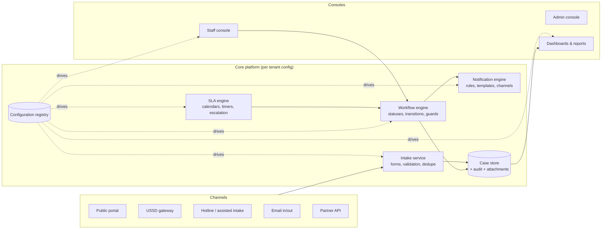

# 01 — Overview, Goals and Architecture Principles

## 1. Purpose

This specification defines a **generic, multi-client electronic Grievance Redress Mechanism (eGRM) platform**. The platform is a configurable product: a single codebase that can be deployed and configured for different clients (government programmes, donor-funded projects, corporations) with materially different grievance processes — without code changes.

The specification is derived from three knowledge sources:

| Source | Contribution |
|---|---|
| **KISIP eGRM** (`plus-admin`, in production) | Field-proven mechanics (SMS tracking links, notification audit, confirmation-before-closure) and an inventory of design defects to avoid (client-side state machine, hardcoded hierarchy/roles/SLAs, unauthenticated write endpoints) |
| **KUSP2 eGRM procurement set** (BRD, ToR + SRS, wireframe report, technical specs, RFQ — Feb 2026) | The requirements baseline: 136 traceable requirements, configurable helpdesk-style architecture (help topics, SLA plans, routing filters), standardized intake dataset, SEA/SH module, NFRs |
| **GRM best-practice corpus** (World Bank ESS10 doctrine, NAVCDP, TAP, Cassava, PSCK, IFC/CAO) | Process doctrine: resolve at lowest level, acknowledgement/response/resolution SLAs, appeal windows, satisfaction capture, standard KPIs, anonymous and survivor-centred handling |

## 2. Product vision

> One platform, many programmes. Every programme gets its own grievance taxonomy, administrative hierarchy, workflow, SLAs, channels, languages, branding and reporting — all defined as configuration, owned by the client, and changeable by an administrator without redevelopment.

### 2.1 What "generic" means here (hard requirements)

1. **No hardcoded administrative hierarchy.** KISIP uses settlement→county→national; KUSP2 uses municipality→county→national; another client may use site→region→HQ or a 2-level structure. The hierarchy is tenant data, of arbitrary depth.
2. **No hardcoded workflow.** Statuses, transitions, who may perform them, required evidence, SLA per stage, escalation triggers, closure/confirmation rules and appeal windows are configuration.
3. **No hardcoded taxonomy.** Case categories ("help topics"), sensitivity classes (GBV/SEA-SH, corruption, …), priorities and expected-outcome lists are configuration.
4. **No hardcoded channels.** Web, assisted intake, email, SMS, USSD, hotline/IVR, API — each is a module enabled/disabled and configured per tenant.
5. **No hardcoded text or branding.** All complainant-facing strings are templates with variables, multi-language, owned by the tenant. Reference-number format, portal theme, logos, legal pages are tenant config.
6. **No hardcoded notification logic.** Recipient selection, channel choice and message content are declarative rules evaluated by a notification engine.

### 2.2 What is fixed (the platform invariants)

Some things are deliberately *not* configurable, because they are correctness or safety properties:

- Server-side enforcement of the configured workflow (clients cannot bypass it).
- Atomicity: a case action (status change + log entry + attachments + notifications queued) commits in one transaction.
- Append-only audit trail for every state-changing operation, including reads of sensitive cases.
- PII handling rules: field-level encryption at rest, redaction by role, consent capture, retention enforcement.
- Authentication on every endpoint except the explicitly designated public surface (intake, status lookup, knowledge base), which is rate-limited and abuse-protected.
- A case always has: a tenant, a unique reference, a category, a jurisdiction, a status from the tenant's configured status set, and a complete history.

## 3. Tenancy and deployment models

The platform MUST support both deployment models below from the same codebase; the choice is per contract:

| Model | Description | When |
|---|---|---|
| **D1 — Dedicated instance per client** | One deployment, one database per client (KISIP-style; satisfies strict data-residency / government-hosted requirements such as KUSP2 Appendix C Option A) | Government clients, data-sovereignty constraints |
| **D2 — Shared multi-tenant SaaS** | One deployment, row-level isolation by `tenant_id` (with optional schema-per-tenant), shared infrastructure | SMEs, pilots, vendor-hosted offering (KUSP2 Option B, ≥99.5% availability) |

Design consequences:

- Every table that holds tenant data carries `tenant_id`; all queries are tenant-scoped at the data-access layer (enforced centrally, e.g. PostgreSQL row-level security), even in D1 (where there is exactly one tenant row). This keeps D1→D2 migration trivial.
- Configuration is stored in the database (not env files) so it is exportable, versioned, and editable through the admin console. Environment variables hold only infrastructure secrets.
- A **tenant configuration export/import** (single signed bundle) supports promotion across environments (dev → staging → prod) and client onboarding from a template.

## 4. High-level architecture

Components (logical; deployable as a modular monolith initially):

| Component | Responsibility |
|---|---|
| **Configuration registry** | Versioned, validated tenant configuration: hierarchy, taxonomy, workflow, SLA plans, forms, templates, roles, channels, branding. See spec 02. |
| **Intake service** | Channel adapters normalize submissions into the standardized intake dataset; validation, duplicate detection, consent capture, reference generation. See spec 05. |
| **Workflow engine** | Server-side state machine instantiated from config; executes case actions atomically with guards. See spec 04. |
| **SLA engine** | Computes due dates from SLA plans + working calendars; emits overdue/at-risk events; runs auto-escalation rules. See spec 04. |
| **Notification engine** | Declarative event→recipient→template→channel rules; queued delivery with per-message audit and per-channel kill switches. See spec 06. |
| **Case store** | Cases, parties, threads, tasks, attachments, referrals, appeals, satisfaction; append-only audit. See spec 03. |
| **Consoles** | Public portal, staff console, admin console, dashboards. Behavioral catalogue follows the KUSP2 wireframe report (145 screens) adapted to config-driven rendering. |

## 5. Design principles

1. **Configuration over code; convention over configuration.** Ship sensible defaults (a reference workflow, standard categories, standard KPIs) so a new tenant is usable in hours; everything is overridable.
2. **The server owns the rules.** The frontend renders what the config and the engine allow; it never decides what is allowed. (Direct lesson from KISIP, where transitions, SLA arithmetic and escalation targets live in Vue components — including a days-vs-milliseconds bug that makes every case instantly overdue.)
3. **Everything observable.** Every action, notification, config change and sensitive-data access is auditable. Disabled notifications are still logged with the reason (a good KISIP pattern to keep).
4. **Lowest-level resolution first.** The default workflow encodes the GRM doctrine: cases start at the lowest configured jurisdiction tier, escalate upward on time/severity/dissatisfaction, and may be returned downward.
5. **Safety by default for sensitive cases.** Sensitivity classes restrict visibility, suppress PII in notifications, force aggregate-only reporting, and route to designated roles — per configured policy.
6. **Complainant-centred closure.** Resolution is not closure: the loop closes with complainant feedback (satisfaction), an appeal window, and (optionally) higher-level confirmation — all configurable per tenant.
7. **No lock-in.** Full data + configuration export in open formats at any time (KUSP2 NFR-17); documented APIs (NFR-16).

## 6. Scope

### In scope
- Multi-channel grievance intake, case management, workflow/SLA/escalation, appeals, referrals, tasks, notifications, knowledge base, reporting/dashboards, admin configuration, audit, public portal with status tracking, sensitive-case module, multi-language.

### In scope — opt-in modules (default off)
- Chatbot intake and AI assistance (auto-categorization, sensitivity detection, semantic dedupe, summarization, translation, draft responses, KB answer assist) — governed, per-tenant opt-in (spec 05 §7). KUSP2 prohibits chatbot intake (FR-PUB-15), so its profile keeps the flag off.

### Out of scope (v1)
- Offline-first mobile sync (low-bandwidth web + assisted intake + USSD cover the need).
- Payments/compensation disbursement (record outcomes only; integrate via API if needed).
- Full document-management system (attachments with access control only).

## 7. Reading order

| Doc | Contents |
|---|---|
| `02-configuration-model.md` | The per-client configuration registry — the heart of genericity |
| `03-domain-model.md` | Entities and data model |
| `04-workflow-engine.md` | Lifecycle, SLA, escalation, appeals, closure |
| `05-intake-and-channels.md` | Channels, forms, standardized intake dataset |
| `06-notifications.md` | Notification rules, templates, delivery |
| `07-security-access-control.md` | RBAC, jurisdiction scoping, sensitive cases, PII |
| `08-reporting-kpis.md` | Dashboards, KPIs, exports |
| `09-api-integrations.md` | API surface, webhooks, SSO, gateways |
| `10-requirements-catalogue.md` | Traceable requirements with priorities and source mapping |
| `11-tenant-profiles.md` | Worked examples: KISIP and KUSP2 expressed as configuration |
