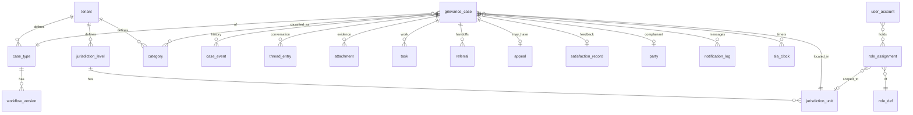

# 03 — Domain & Data Model

All tables carry `tenant_id` plus `created_at`/`updated_at`. Soft deletion is modeled as status/flag where business-relevant; physical deletion happens only via retention jobs. Names are indicative (snake_case, PostgreSQL assumed; any relational store works).

## 1. Entity overview

## 2. Core entities

### 2.1 `tenant`
`id, code, name, status, default_locale, locales[], timezone, deployment_model, created_at`

### 2.2 Jurisdictions
- **`jurisdiction_level`** — `id, tenant_id, rank (1=lowest), code, name_i18n, is_intake_default, is_confirmation_authority, can_be_assigned`
- **`jurisdiction_unit`** — `id, tenant_id, level_id, parent_unit_id, code, name, geo (nullable geometry), active`

The unit tree is the backbone for routing, scoping and reporting. Arbitrary depth; KISIP would load 3 levels (settlement/county/national), KUSP2 3 levels (municipality/county/national), a corporate client maybe 2.

### 2.3 Taxonomy
- **`case_type`** — `id, tenant_id, code, name_i18n, numbering_pattern, default_workflow_id, default_sla_plan_id, anonymity_policy, active`
- **`category`** — `id, tenant_id, parent_id, code, name_i18n, sensitivity_class_id, default_department_id, sla_plan_override_id, routing_hint, active`
- **`sensitivity_class`** — `id, tenant_id, code (standard|gbv_seah|corruption|custom...), policy jsonb` (visibility, redaction, reporting mode, designated roles — spec 07)
- **`priority_def`** — `id, tenant_id, rank, code, name_i18n, sla_plan_override_id`
- **`list_def` / `list_item`** — admin-defined controlled lists for custom fields

### 2.4 The case

**`grievance_case`** (the aggregate root; deliberately *thin* — workflow state, not workflow rules):

| Column group | Columns |
|---|---|
| Identity | `id (uuid)`, `reference (unique per tenant)`, `case_type_id`, `workflow_version_id` (pinned at creation) |
| Classification | `categories[] (m2m)`, `priority_id`, `sensitivity_class_id` (denormalized from category, overridable upward only), `expected_outcomes[]` |
| Location | `jurisdiction_unit_id` (where it occurred), `current_level_id` (where it is being handled — escalation moves this), `location_text`, `geo (nullable)` |
| State | `status_id`, `status_since`, `previous_status_id`, `on_legal_hold bool` |
| People | `complainant_party_id (nullable — anonymous)`, `submitted_by_user_id (nullable — staff-assisted)`, `assignee_user_id`, `assignee_team_id`, `department_id`, `collaborators[]` |
| Submission | `channel`, `submitted_at`, `received_at`, `consent_record_id`, `is_anonymous`, `representative jsonb (nullable)`, `reported_elsewhere jsonb` |
| Content | `summary`, `description`, `custom_fields jsonb` (validated against the case type's form definition) |
| Resolution | `resolution_summary`, `resolved_at`, `closed_at`, `closure_reason_id`, `confirmation jsonb (by, at, level, notes)` |
| Flags | `is_duplicate_of (case id)`, `merged_into (case id)`, `reopen_count` |

Constraints: `reference` unique per tenant; a partial unique index for duplicate suppression is **per-tenant configurable** (expression index built from the configured dedupe rule), replacing KISIP's hardcoded `(description, settlement_id, age, gender, phone)` constraint.

### 2.5 Parties and PII

**`party`** — a person or organization referenced by cases:
`id, tenant_id, kind (person|organization), name_enc, national_id_enc, phone_enc, email_enc, address_enc, gender, age_band, vulnerable_group_tags[], preferred_contact_method, preferred_locale, user_account_id (nullable — registered complainant)`

- PII columns are **encrypted at the application layer** (per-tenant data key, envelope encryption; never SQL-string-interpolated keys as in KISIP).
- Searchable lookups use salted hashes (e.g. `phone_hash`) — supports "find cases by phone" without decrypting at query time.
- A party can have many cases; this gives complainant history (KUSP2 complainant directory FR-USER-01) and repeat-complainant analytics.

**`consent_record`** — `id, party_id (nullable for anonymous), case_id, privacy_notice_version, checkboxes jsonb, captured_at, captured_channel, captured_by`

### 2.6 History & conversation

- **`case_event`** (append-only audit of the case): `id, case_id, seq, kind (created|status_changed|assigned|level_moved|edited|escalated|referred|appealed|reopened|confirmed|closed|sla_breached|merged|...) , actor_user_id (nullable=system/public), payload jsonb (before/after for edits), at`
  - Replaces KISIP's three overlapping tables (`grievance_log`, `grievance_history`, controller-side logging) with one source of truth. "Revert edit" replays an inverse payload as a new event.
- **`thread_entry`** (communication): `id, case_id, direction (inbound|outbound|internal_note), channel, author_user_id/party_id, body_richtext, visibility (public|staff), attachments[], at`
  - Internal notes are never exposed to public surfaces — enforced at the query layer, not the UI.
- **`task`**: `id, case_id, title, description, assignee, due_at, priority, status (open|done|cancelled), created_by`
- **`attachment`**: `id, case_id, thread_entry_id (nullable), task_id (nullable), kind (evidence|signed_resolution_form|acknowledgement|other — tenant-extensible), filename, mime, size, sha256, storage_key, visibility, malware_scan_status, uploaded_by, uploaded_at` — binary content in object storage, access always via authorizing endpoint with audit.

### 2.7 Workflow & SLA state

- **`workflow_version`**: `id, case_type_id, version, definition jsonb (statuses, transitions, policies), status (draft|active|retired), activated_at, activated_by`
- **`status_def`** (projection of definition for FK integrity): `id, workflow_version_id, code, name_i18n, tag`
- **`sla_plan`** / **`calendar`**: as configured (CD-05); calendars hold working hours + holiday dates.
- **`sla_clock`**: `id, case_id, kind (acknowledge|first_response|resolution|stage), started_at, due_at, paused_periods jsonb, satisfied_at, breached_at`
  - Due dates are **computed and stored server-side** by the SLA engine; clients never supply expiry dates (KISIP let the browser set `status_expiry_date` — root cause of its broken SLA data).
- **`escalation_rule`** / **`escalation_event`**: rule config + an audit row each time a rule fires (KISIP's empty `grievance_escalation` table becomes real).

### 2.8 Loop-closing entities

- **`referral`**: `id, case_id, kind (internal_unit|external_institution), target_institution_id/target_unit_id, reason, sent_at, external_reference, outcome, returned_at`
- **`appeal`**: `id, case_id, round, raised_by (party|staff), reason, raised_at, routed_to_level_id, decision, decided_by, decided_at`
- **`satisfaction_record`**: `id, case_id, response (satisfied|not_satisfied|na_anonymous|no_response), channel, captured_at, comment`
- **`committee` / `committee_member` / `committee_decision`**: optional module; decisions link to `case_event`s.

### 2.9 Notifications

- **`notification_rule`** (config, CD-09) and **`notification_log`**: `id, case_id (nullable), event_kind, recipient_kind (party|user|role_broadcast), recipient_address_hash, channel, template_id, locale, rendered_preview (PII-redacted), status (queued|sent|delivered|failed|suppressed:reason), provider_message_id, attempts, at`
  - Keeps KISIP's best feature — every send (including suppressed ones) is auditable — generalized to all channels.

### 2.10 Identity & access

- **`user_account`**: `id, tenant_id, username/email, phone, password_hash, mfa jsonb, sso_subject, status, locale, last_login_at`
- **`role_def`**: `id, tenant_id, code, name, permissions[] (from fixed catalogue), sensitive_classes[] (which sensitivity classes this role may see)`
- **`role_assignment`**: `id, user_id, role_id, jurisdiction_unit_id (nullable=tenant-wide), department_id (nullable), valid_from, valid_to`
  - Time-bounded assignments (KISIP's role-expiry concept, kept).
- **`department` / `team` / `team_member`**: routing containers.
- **`api_key`**: scoped keys for partner integrations.

### 2.11 Platform & ops

- **`audit_event`** (system-wide, beyond per-case events): logins, config changes, exports, sensitive-case views, permission denials. `actor, action, object_type/id, ip, user_agent, at, detail jsonb`. Append-only, hash-chained for tamper evidence.
- **`config_version`**: registry storage (domain, version, body jsonb, status, author, note).
- **`knowledge_article` / `faq` / `canned_response`**: knowledge module.
- **`dashboard_def` / `dashboard_section` / `dashboard_widget`**: admin-built dashboard config (CD-15); widget definitions reference semantic-layer datasets, never raw tables (spec 08 §2).
- **`ai_interaction`**: audit record for every AI call (capability, provider/model+version, input hash, suggestion, confidence, accept/reject + deciding user) and chatbot transcripts linked to cases (spec 05 §7).
- **`saved_view`**: per-user/shared queue definitions (filters, columns, sort).
- **`retention_policy` / `retention_job_run`**: scheduled anonymization/archival with run logs.

## 3. Key modeling decisions (vs. KISIP)

| Decision | Rationale |
|---|---|
| `case_event` single audit stream | KISIP splits history across `grievance_log`, `grievance_history` and notifications; reconstruction requires joins and guesswork |
| Workflow pinned per case (`workflow_version_id`) | Config changes never corrupt in-flight cases; explicit migration mapping if the tenant wants to move them |
| Levels/units as data, not columns | KISIP's `county_id/subcounty_id/ward_id/settlement_id` columns hardwire Kenya's geography; the unit tree supports any client |
| Party separated from case | Enables anonymous cases (null party), complainant history, registered accounts, and clean PII encryption boundaries |
| SLA clocks server-computed | KISIP trusts browser-supplied expiry dates (and has a live unit bug) |
| Sensitivity as a class with policy, not a boolean | KISIP's `isgbv` boolean can't express corruption-case rules or per-class reporting modes |
| Status semantic tags | Cross-tenant reporting ("% resolved") works even though tenants name statuses differently |

## 4. Indexing & volume notes

- Hot paths: queue queries (`tenant_id, status_tag, current_level_id, assignee`), reference lookup (`tenant_id, reference`), party lookup by `phone_hash`.
- `case_event`, `notification_log`, `audit_event` are append-only → BRIN/partitioning by month at scale.
- Sizing baseline per KUSP2: hundreds of staff users, tens of thousands of cases/year per tenant — modest; design for 100× headroom (NFR-02).
