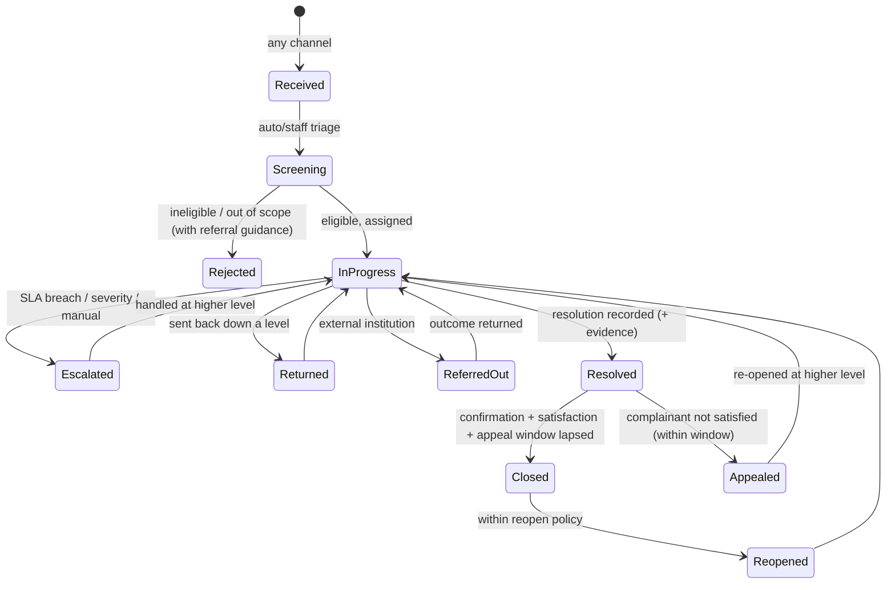

# 04 — Workflow Engine: Lifecycle, SLA, Escalation, Appeals, Closure

The workflow engine executes each tenant's configured case lifecycle **server-side**. The UI renders available actions by asking the engine; it never computes permissions, transitions, levels or due dates itself.

## 1. Reference lifecycle (default template)

Shipped as the platform default (tenants override freely). It encodes the GRM doctrine common to KISIP, KUSP2, NAVCDP and the World Bank guidance:



Key doctrine points enforced by the default policies:

1. **Explicit screening step** with an ineligibility outcome that records *why* and *where the complainant was redirected* (gap in KISIP; required by NAVCDP/Cassava/KUSP2).
2. **Resolution ≠ closure.** Closure requires (configurably): resolution summary + evidence, complainant notified, satisfaction captured (or N/A-anonymous), appeal window lapsed or waived, and higher-level confirmation where configured (KISIP's national-confirmation pattern, generalized).
3. **Escalation moves the handling level up the jurisdiction tree; Return moves it down.** Direction comes from the configured hierarchy (CD-02), never from hardcoded names.

## 2. The action API (atomicity)

Every staff operation is a single **case action** request:

```
POST /api/v1/cases/{id}/actions
{ "action": "transition", "to_status": "Resolved",
  "note": "...", "fields": {...}, "attachments": [...],
  "assignee": ..., "idempotency_key": "..." }
```

The engine, in **one database transaction**:

1. Loads the case + its pinned `workflow_version`.
2. Evaluates **guards** (see §3). Any failure → typed error, nothing persisted.
3. Applies the transition: status, level moves, assignee changes, resolution fields.
4. Writes the `case_event` (+ thread entry if a note/reply was included, + attachments).
5. Updates SLA clocks (stop/satisfy/restart per transition config).
6. Enqueues notifications (outbox pattern — delivery is async, enqueueing is transactional).

No client-orchestrated multi-call sequences and no client-side rollback (KISIP's pattern). `idempotency_key` makes retries safe.

## 3. Guards (transition preconditions)

Configured per transition; evaluated server-side:

| Guard | Examples |
|---|---|
| **Role** | only roles listed may execute |
| **Level** | actor's jurisdiction scope must cover the case's `current_level`/unit (national acts anywhere; county on its subtree; etc.) |
| **Required fields** | `resolution_summary` for Resolve; `reason` for Reject/Return |
| **Required attachments** | attachment of kind `signed_resolution_form` for Resolve (KISIP practice, kept as config) |
| **Required note** | free-text justification |
| **Case state** | no open blocking tasks; not on legal hold; appeal window state |
| **Approval** | transition requires second-person approval when priority ≥ X or sensitivity ∈ Y (KUSP2 closure checklist / supervisory approval) |
| **Committee decision** | a committee decision record must be attached (optional module) |

## 4. SLA engine

### 4.1 Clocks

Per case, up to four clock kinds (per SLA plan):

| Clock | Starts | Satisfied by |
|---|---|---|
| `acknowledge` | submission | acknowledgement notification delivered (or manual ack) |
| `first_response` | submission | first outbound `thread_entry` |
| `resolution` | submission (or eligibility confirmation — configurable) | entering a `resolved`-tagged status |
| `stage` | each status entry (if stage durations configured) | leaving the status |

### 4.2 Computation rules

- Due dates = start + target, computed over the bound **calendar** (working hours/holidays) when the plan says working time; calendar time otherwise.
- Stored on `sla_clock`; **never** accepted from clients.
- Pauses: configurable statuses (e.g. `Awaiting Complainant Information`, `In Court`) pause specified clocks; pause periods are recorded.
- Changing priority/category mid-case re-resolves the SLA plan (configurable: recompute vs keep).

### 4.3 Breach handling

A scheduler (fixed cadence, e.g. every 15 min — not KISIP's random weekly cron) evaluates clocks:

- **At-risk** (configurable lead time, e.g. T-2 days): reminder notification to assignee; case flagged in queues.
- **Breach**: `sla_breached` case event; notification per rules; **escalation rules** evaluated.
- All evaluations are idempotent and logged.

## 5. Escalation rules

Declarative, per tenant (CD-05):

```yaml
- name: overdue-auto-escalate
  trigger: {clock: stage, state: breached}
  condition: {status_tag: in_progress, level_below: top}
  action:
    - move_level: up
    - set_status: Escalated
    - notify: {role: grm_officer, scope: new_level_unit}
- name: emergency-priority
  trigger: {on: case_created}
  condition: {priority: Emergency}
  action: [{notify: {role: supervisor, scope: unit}}, {set_sla_plan: emergency}]
- name: dissatisfaction-appeal
  trigger: {on: satisfaction_recorded}
  condition: {response: not_satisfied}
  action: [{open_appeal: {route: next_level}}]
```

Triggers: clock states, case events, manual invocation. Actions: move level, set status, reassign, change priority/SLA plan, notify, open appeal, create task. Every firing writes an `escalation_event`.

Manual escalation remains a normal transition with guards; complainant-initiated escalation/appeal comes through the public surface (§7).

## 6. Closure pipeline (configurable stages)

```
Resolved → [confirmation] → [satisfaction capture] → [appeal window] → Closed
```

| Stage | Config | Behavior |
|---|---|---|
| **Confirmation** | `required_when` (e.g. resolved below level X), `authority_level`, captured fields | Generalizes KISIP's national confirmation. Confirmation is itself a guarded action with its own audit fields |
| **Satisfaction** | enabled, channels (SMS reply, portal link, staff phone capture), reminder schedule, timeout behavior | Outcome stored on `satisfaction_record`; `not_satisfied` can trigger appeal rule; anonymous → `na_anonymous` |
| **Appeal window** | days, who may appeal, max rounds, routing | While open, case sits in `Resolved`; lapse → auto-transition to `Closed` (system actor) |
| **Closure** | checklist fields, closure reason code, supervisory approval thresholds | Closing writes `closed_at`; retention clock starts |

Reopen policy: who (complainant within N days / staff with permission), resulting status, increment `reopen_count`, full audit.

## 7. Public/complainant-initiated actions

Via the public portal/USSD/hotline (verified by reference + verifier; spec 05):

| Action | Behavior |
|---|---|
| Add information / reply | Creates inbound `thread_entry`; may un-pause `awaiting information` status per config |
| Express dissatisfaction / appeal | Within window → `appeal` record + routing; outside window → recorded, staff notified |
| Self-escalate | If tenant enables it (KISIP feature): guarded equivalent of escalation, rate-limited, audited with `actor=complainant` |
| Withdraw | Transition to closure with reason `withdrawn` (confirmation prompt) |

## 8. Engine guarantees

1. **Determinism**: same case + same action + same config version → same result.
2. **Total auditability**: every state change has exactly one `case_event` with actor and before/after.
3. **No orphan states**: validation (spec 02 §3) guarantees a path to closure from every reachable status.
4. **Version isolation**: in-flight cases run on their pinned workflow version until explicitly migrated.
5. **Clock integrity**: all SLA timestamps system-computed; UI displays only.
6. **Concurrency**: optimistic locking on the case row (`version` column); conflicting concurrent actions fail cleanly with retry guidance.
