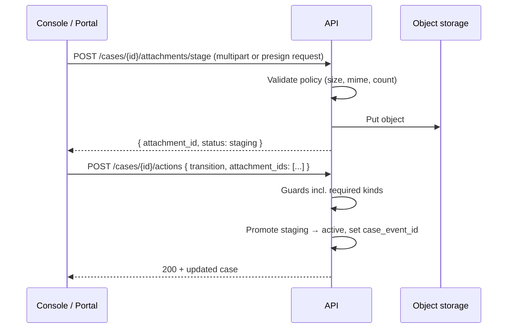

# 14 — Case Attachments & Documents

How files (evidence, reports, signed forms, correspondence) are captured, stored, linked to workflow steps, and exposed across intake, status updates, reporting, and exports. This is **attachment management with access control**, not a full document-management system (spec 01 §2).

**Status:** Specification draft v0.1 — design before implementation. Extends [03-domain-model.md](03-domain-model.md) §2.6, [04-workflow-engine.md](04-workflow-engine.md) §2–3, [07-security-access-control.md](07-security-access-control.md), [13-staff-console-case-handling.md](13-staff-console-case-handling.md), and [15-complainant-correspondence.md](15-complainant-correspondence.md) (thread attachments).

---

## 1. Problem statement

GRM practice requires documentary evidence at almost every stage:

| Stage | Typical documents |
|---|---|
| **Intake** | Photos, ID copies, location sketches, prior correspondence |
| **Investigation / sorting** | Field visit notes, interview summaries, site photos |
| **Status updates** | Investigation reports, legal opinions, committee minutes |
| **Resolution** | Signed resolution form, mediation agreement, compensation schedule |
| **Closure / confirmation** | National confirmation letter, satisfaction record printout |
| **Appeal / escalation** | Appeal letter, supervisory review memo |

KISIP (`plus-admin`) uploads documents **after** logging the action in separate HTTP calls (`logGrievanceAction` → `uploadGrievanceDocuments`). A failed upload leaves the case in the new status without evidence — the defect this platform fixes via **atomic case actions** (GEN-WF-02).

---

## 2. Design principles

| Principle | Rule |
|---|---|
| **Atomic linkage** | Attachments required or optional for a transition are committed in the **same transaction** as the `case_event` / status change (spec 04 §2). No orphan status without promised evidence. |
| **Staged upload, confirmed link** | Large files upload to object storage first (staged); the action request references staged attachment IDs. The engine validates and links them atomically. |
| **Kind-driven semantics** | Every file has a **kind** (`evidence`, `signed_resolution_form`, …) configured per tenant. Workflow guards reference kinds, not filenames. |
| **Context binding** | An attachment is always tied to a **case** and optionally to the **event** that introduced it (status change, thread reply, task completion, intake). |
| **Authorizing access only** | Binaries never sit on the web root. Download always goes through `GET …/attachments/{id}/download` with permission + jurisdiction + sensitivity checks and audit. |
| **Visibility is explicit** | `public` (complainant may see on track portal), `staff` (console only), `restricted` (clearance + permission). Sensitivity class may force `staff` or redact from exports. |
| **Configurable policy** | Size, count, MIME allow-list, malware scan, and required kinds per transition come from CD-06 / CD-04 — not hard-coded. |

---

## 3. Attachment kinds (taxonomy)

### 3.1 Platform default kinds

Shipped catalogue; tenants may add custom kinds in CD-06.

| Kind code | Label (EN) | Typical use | Default visibility |
|---|---|---|---|
| `evidence` | Evidence | Photos, scans, supporting material at any stage | `staff` |
| `investigation_report` | Investigation report | Formal investigation output | `staff` |
| `signed_resolution_form` | Signed resolution form | Required for Resolve in KISIP-style workflows | `staff` |
| `acknowledgement` | Acknowledgement | Intake receipt, official ack letter | `public` |
| `correspondence` | Correspondence | Letters, emails saved as PDF | `staff` |
| `committee_minutes` | Committee minutes | GMC / settlement committee decisions | `staff` |
| `legal` | Legal document | Court orders, legal opinions | `restricted` |
| `other` | Other | Fallback when kind not specified | `staff` |

### 3.2 Configuration (CD-06)

Implemented in **CD-06 Intake forms** → **Document types** and **Upload policy** (console admin). Schema: `packages/config-schemas/src/attachment-kinds.ts`.

```yaml
attachment_kinds:
  - code: signed_resolution_form
    label: { en: "Signed resolution form", sw: "Fomu ya utatuzi iliyosainiwa" }
    default_visibility: staff
    allowed_mime: [application/pdf, image/jpeg, image/png]
    max_size_mb: 10
  - code: investigation_report
    label: { en: "Investigation report" }
    default_visibility: staff
    allowed_mime: [application/pdf, application/vnd.openxmlformats-officedocument.wordprocessingml.document]
    max_size_mb: 25

attachment_policy:
  max_files_per_action: 10
  max_files_per_case: 200
  max_total_case_size_mb: 500
  allowed_mime_default: [application/pdf, image/jpeg, image/png, image/webp]
  block_executable: true
  malware_scan: optional   # tenant toggle; GEN-INT-15
  duplicate_detection: warn  # warn | block — same sha256 on same case
```

### 3.3 Workflow requirements (CD-04)

Transitions declare required kinds:

```yaml
transitions:
  - from: [Investigation, Escalated, Returned]
    to: Resolved
    roles: [grm_officer]
    requires:
      fields: [resolution_summary]
      attachments: [signed_resolution_form]   # at least one each
      note: true
  - from: [Sorting]
    to: Investigation
    requires:
      attachments: []   # optional; UI may still offer upload
    allows:
      attachments: [evidence, investigation_report]
```

Guard evaluation (spec 04 §3):

- `required_attachment_missing` — transition lists kind `K` but action payload has no staged attachment of kind `K` linked to this action.
- `attachment_kind_not_allowed` — staged attachment kind not in transition `allows.attachments` (when list is non-empty).
- `attachment_policy_violation` — size/MIME/count limits from CD-06.

---

## 4. Data model

Extends spec 03 §2.6 `attachment` table. Proposed columns:

| Column | Type | Notes |
|---|---|---|
| `id` | uuid | PK |
| `tenant_id` | uuid | FK |
| `case_id` | uuid | FK — always set |
| `case_event_id` | uuid nullable | FK — set when linked by a workflow action or manual upload with event context |
| `thread_entry_id` | uuid nullable | FK — when attached to a thread reply |
| `task_id` | uuid nullable | FK — when attached to a task |
| `kind` | text | From `attachment_kinds` catalogue |
| `title` | text nullable | Officer-provided label; defaults to filename |
| `filename` | text | Original name |
| `mime` | text | Sniffed + declared; declared must match sniff or reject |
| `size_bytes` | bigint | |
| `sha256` | text | Content hash at ingest |
| `storage_key` | text | Opaque object-store path `{tenant}/{case_id}/{attachment_id}` |
| `visibility` | enum | `public` \| `staff` \| `restricted` |
| `status` | enum | `staging` \| `active` \| `quarantined` \| `deleted_soft` |
| `malware_scan_status` | enum | `pending` \| `clean` \| `infected` \| `skipped` \| `failed` |
| `uploaded_by` | uuid nullable | Staff user; null for complainant/public upload |
| `uploaded_by_party_id` | uuid nullable | Complainant when public intake |
| `upload_channel` | text | `console` \| `portal` \| `api` \| `email_inbound` \| `migration` |
| `created_at` | timestamptz | |
| `deleted_at` | timestamptz nullable | Soft delete; retention job may purge blob later |

**Staging lifecycle:** uploads start as `status=staging`. They are promoted to `active` only when referenced by a successful case action (or explicit `POST …/attachments/{id}/commit` for standalone uploads). Staging rows older than 24 h are garbage-collected (blob + row).

**Event payload reference:** `case_event.payload` for `status_changed` includes:

```json
{
  "attachment_ids": ["uuid", "..."],
  "attachment_summary": [
    { "id": "uuid", "kind": "investigation_report", "filename": "report.pdf" }
  ]
}
```

---

## 5. Upload & download flows

### 5.1 Staged upload (staff console / portal)



**Two upload modes:**

1. **Direct multipart** — `POST /api/v1/cases/{id}/attachments/stage` with `file`, `kind`, optional `visibility`. Suitable for smaller files and simpler console integration.
2. **Presigned URL** — `POST …/attachments/presign` returns `{ upload_url, attachment_id, headers }`; client PUTs to object storage; `POST …/attachments/{id}/complete` finalizes metadata. Preferred for large files and mobile portal.

### 5.2 Atomic status update with documents

Extends spec 13 §4. Actions tab gains an **Attachments** section when the selected transition allows or requires files.

```
POST /api/v1/cases/{id}/actions
{
  "action": "transition",
  "to_status": "Resolved",
  "action_taken": "Mediation completed; parties signed agreement.",
  "update_summary": "Status → Resolved; signed form attached.",
  "fields": { "resolution_summary": "..." },
  "attachment_ids": [
    "a1111111-....",   // staged signed_resolution_form
    "a2222222-...."    // optional extra evidence
  ]
}
```

Server order inside the transaction:

1. Validate transition + attachment guards.
2. For each `attachment_id`: row must be `staging`, same `case_id`, not expired; promote to `active`.
3. Write `case_event` with `attachment_ids` in payload.
4. Enqueue notifications (attachment names are **not** included in SMS; optional in email per template).

### 5.3 Standalone upload (no status change)

Officers may add documents without transitioning — e.g. mid-investigation evidence.

```
POST /api/v1/cases/{id}/attachments
{ "attachment_ids": ["..."], "note": "Site photos from 12 Jun visit" }
```

Creates `case_event` kind `attachment_added` (visibility `staff`) and links files. Permission: `attachment:upload`.

### 5.4 Download

```
GET /api/v1/cases/{id}/attachments/{attachment_id}/download
→ 302 to short-lived signed URL, or streamed body
```

Checks: `attachment:download` or `attachment:read_protected` for `restricted`; jurisdiction scope; sensitivity clearance; visibility rules for complainant session. Writes `audit_event` `attachment.downloaded`.

### 5.5 Public / complainant surfaces

- **Intake:** attachments staged during form submit; committed when case is created (`POST /public/cases` multipart).
- **Track / reply:** complainant may attach files when posting a thread reply (`POST /public/cases/{ref}/reply`) — spec [15](15-complainant-correspondence.md); stricter policy than staff; rate-limited.
- **Public visibility:** only attachments with `visibility=public` appear on track portal; staff must explicitly mark acknowledgement letters public.

---

## 6. Console UX (staff)

### 6.1 New **Documents** tab on case detail

Route: `/cases/{id}` — tab order: Overview → Actions → **Documents** → Assignment → Notifications → Timeline.

| Section | Content |
|---|---|
| **All documents** | Table: kind, title/filename, size, uploaded by, date, linked event (status / note), visibility badge, download |
| **Filter** | By kind, by workflow stage (via linked event), public vs staff |
| **Upload** | Standalone upload with kind picker + optional note (permission `attachment:upload`) |

### 6.2 Actions tab — per-transition attachment block

When staff selects a target status in the Actions form:

| UI state | Behaviour |
|---|---|
| Transition `requires.attachments` non-empty | Show required kinds with labels; upload control per kind; block submit until satisfied |
| Transition `allows.attachments` set | Optional multi-file upload filtered to allowed kinds |
| No attachment config | Hide block (current behaviour) |

Reuse staged upload component; show upload progress; allow remove before submit (deletes staging row).

### 6.3 Timeline integration

`status_changed` events with attachments show a paperclip summary in Timeline tab; click expands to list with download links.

---

## 7. Reporting & exports

| Output | Attachment behaviour |
|---|---|
| **Case file PDF** (GEN-CASE-07) | Lists all `active` attachments with kind, date, uploader; does not embed binaries by default; optional ZIP bundle export |
| **Operational reports** (spec 08) | Count of cases with/without required resolution attachment; never expose filenames with PII in aggregates |
| **Transparency page** | No attachment binaries; counts only |
| **Full tenant export** (spec 09 §3) | Manifest CSV + blob archive; `storage_key` + `sha256` for integrity verification |
| **Sensitive cases** | `restricted` attachments excluded from standard exports; break-glass audited |

---

## 8. Security & compliance

| Control | Implementation |
|---|---|
| Permissions | `attachment:upload`, `attachment:download`, `attachment:read_protected`, `attachment:delete_soft` (spec 07) |
| MIME sniffing | Reject mismatch (e.g. `.pdf` containing executable) |
| Malware scan | Async hook after stage; `quarantined` until `clean`; infected → soft-delete + alert |
| Encryption at rest | Object storage SSE; optional tenant CMK |
| Audit | `attachment.uploaded`, `attachment.downloaded`, `attachment.deleted`, `attachment.quarantined` on `audit_event` |
| Retention | Follow case retention policy; anonymized cases strip `uploaded_by` / party link, delete blobs per CD-13 |
| Legal hold | Blocks soft-delete of attachments on held cases |

---

## 9. API surface (summary)

| Method | Path | Permission | Purpose |
|---|---|---|---|
| `POST` | `/api/v1/cases/{id}/attachments/stage` | `attachment:upload` | Multipart staged upload |
| `POST` | `/api/v1/cases/{id}/attachments/presign` | `attachment:upload` | Get presigned PUT URL |
| `POST` | `/api/v1/cases/{id}/attachments/{aid}/complete` | `attachment:upload` | Finalize after presigned PUT |
| `POST` | `/api/v1/cases/{id}/attachments` | `attachment:upload` | Commit staged files with optional note (no transition) |
| `GET` | `/api/v1/cases/{id}/attachments` | `case:read` | List (scoped by visibility) |
| `GET` | `/api/v1/cases/{id}/attachments/{aid}/download` | `attachment:download` | Authorized download |
| `PATCH` | `/api/v1/cases/{id}/attachments/{aid}` | `attachment:upload` | Update title, visibility (not binary) |
| `DELETE` | `/api/v1/cases/{id}/attachments/{aid}` | `attachment:delete_soft` | Soft delete if policy allows |
| `POST` | `/api/v1/cases/{id}/actions` | `case:transition` | **Includes `attachment_ids`** — primary workflow path |
| `POST` | `/public/cases` | public + CAPTCHA | Intake with staged attachment IDs |
| `POST` | `/public/cases/{ref}/reply` | verified complainant | Optional attachments on reply |

`GET …/available-actions` response extended:

```json
{
  "type": "transition",
  "to_status": "Resolved",
  "requires": {
    "attachments": [{ "kind": "signed_resolution_form", "label": "Signed resolution form", "min_count": 1 }]
  },
  "allows": {
    "attachments": [{ "kind": "evidence", "label": "Evidence", "max_count": 5 }]
  }
}
```

---

## 10. Implementation phases

| Phase | Scope | Requirements |
|---|---|---|
| **14a — Foundation** | Schema, object storage adapter, stage/commit lifecycle, list + download, audit | GEN-INT-14 |
| **14b — Workflow integration** | `attachment_ids` on `POST …/actions`, CD-04 guards, `available-actions` metadata | GEN-WF-02, GEN-WF-03 |
| **14c — Console** | Documents tab, Actions tab upload block | GEN-CASE-03 |
| **14d — Portal** | Intake + track reply uploads | GEN-INT-02 |
| **14e — Hardening** | Malware scan hook, presigned URLs, duplicate detection, export manifest | GEN-INT-15, GEN-CASE-07 |

**Dependency:** Phase 14b should land with or immediately after current Actions tab (spec 13 §4).

---

## 11. Open questions for review

1. **Presigned vs multipart default** — presigned for production (>5 MB), multipart for dev/MVP?
2. **Officer-supplied kind on optional uploads** — free picker vs fixed `evidence` default?
3. **Versioning** — if officer re-uploads a corrected resolution form, keep both versions (recommended) or replace?
4. **Generated PDFs** — should auto-generated resolution PDFs (KISIP `generatePDFform`) be stored as `attachment` kind `generated_resolution` or only rendered on demand?
5. **Email inbound** — scope email-to-case attachments in Phase 14 or defer to channel adapter work (spec 05)?
6. **Committee module** — link `committee_decision` records to required `committee_minutes` attachment?

---

## 12. KISIP migration notes

| KISIP pattern | eGRM replacement |
|---|---|
| `grievance_document` + `action_id` FK | `attachment.case_event_id` |
| `type: Supporting Documentation` free text | Configured `kind` catalogue |
| `protected_file: true` flag | `visibility: staff` + permission check |
| Upload after `logGrievanceAction` | Same-request `attachment_ids` on atomic action |
| Open `/upload` endpoint | Authenticated stage + policy enforcement only |

---

## 13. Requirements traceability

| ID | Coverage in this document |
|---|---|
| GEN-INT-02 | §5.5 intake attachments |
| GEN-INT-14 | §2, §5, §8 policy + authorized download |
| GEN-INT-15 | §3.2, §8 malware scan hook |
| GEN-WF-02 | §5.2 atomic action linkage |
| GEN-WF-03 | §3.3 required attachment guards |
| GEN-WF-09 | §3.1 `signed_resolution_form` on Resolve |
| GEN-CASE-03 | §6 console Documents tab + Actions upload |
| GEN-CASE-07 | §7 PDF dossier attachment list |

---

*Cross-references: [03-domain-model.md](03-domain-model.md) · [04-workflow-engine.md](04-workflow-engine.md) · [05-intake-and-channels.md](05-intake-and-channels.md) · [07-security-access-control.md](07-security-access-control.md) · [09-api-integrations.md](09-api-integrations.md) · [13-staff-console-case-handling.md](13-staff-console-case-handling.md) · [10-requirements-catalogue.md](10-requirements-catalogue.md)*
