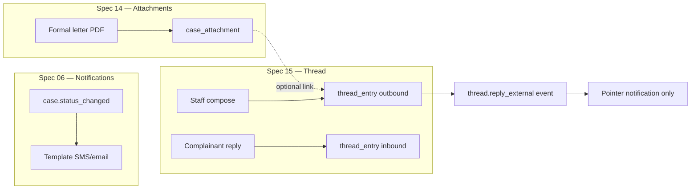

# 15 — Complainant Correspondence & Case Thread

How staff and complainants exchange substantive messages about a case — distinct from one-way **notifications** (spec 06) and from **document files** (spec 14). Covers the case thread, logged offline contact, portal reply, configuration, and notification hooks.

**Status:** Partially implemented — API, DB, console correspondence tab, portal track/reply, CD-17 config editor, seed, and thread notification rules. Workflow auto-unpause on inbound reply pending.

---

## 1. Problem statement

GRM programmes must keep a **durable, auditable record** of what was said to the complainant and what they said back — not only that a status changed.

| Practice | Today in KISIP / gaps in eGRM |
|---|---|
| Officer asks complainant for more information | Often a phone call with no structured log; or narrative buried in `action_taken` on status change |
| Complainant adds detail after submission | No portal reply flow yet; spec 05 / 09 define `POST …/reply` but it is unimplemented |
| Formal acknowledgement / resolution letter | PDF attachment (spec 14 `correspondence` / `acknowledgement` kinds) — separate from free-text thread |
| SMS / email alerts | Spec 06 — one-way templates; must not be confused with the conversation record |
| First-response KPI | Spec 04 / 08 — measured to first **outbound thread entry**, not first notification |

Without a correspondence model, staff conflate **timeline events**, **notification logs**, and **documents** — complainants have no clear place to read messages and reply.

---

## 2. Design principles

| Principle | Rule |
|---|---|
| **Notifications ≠ correspondence** | Notifications (spec 06) are short, templated, event-driven alerts. Correspondence is human-authored content stored on `thread_entry` with a full audit trail. A new message may **trigger** a notification (“You have a new message — track your case”) but the body lives in the thread. |
| **Two visibility planes** | `public` entries are visible on the track portal; `staff` entries are console-only (internal notes use `direction=internal_note`, never exposed publicly). |
| **Server-enforced boundaries** | Public queries return only `visibility=public` rows. Sensitive cases may apply **redacted outbound** text for complainants while staff see full content (CD-17). |
| **Atomic write + notify** | Creating an outbound message commits `thread_entry` + `case_event` in one transaction; notification outbox enqueues inside the same transaction (spec 06 §2). |
| **Attachments reuse spec 14** | Files on a message link via `case_attachment.thread_entry_id`; intake/reply policies from CD-06 apply per channel. |
| **Configurable, not hard-coded** | Who may initiate, which channels, max length, reply attachments, and auto-workflow effects come from **CD-17** — not code branches per tenant. |
| **Offline contact counts** | Phone calls and field visits are logged as `logged_contact` entries so first-response and handover reporting stay honest. |

---

## 3. Correspondence vs notifications vs documents



| Artifact | Purpose | Complainant sees |
|---|---|---|
| `notification_log` | Delivery record of templated alert | SMS/email body (short); not the system of record for long narrative |
| `thread_entry` | Conversation / contact log | Public entries on track portal **Messages** |
| `case_attachment` | Binary evidence or formal letter | Public attachments only; may attach to a thread entry |
| `case_event` `status_changed` | Workflow audit | Public timeline summary (`action_taken`, `update_summary`) — not a substitute for thread |

**Status-update narrative:** `action_taken` / `update_summary` (spec 13 §4) remain on the timeline. CD-17 may optionally **mirror** outbound status text into the thread (`mirror_status_updates: true`); default **off** to avoid duplicate noise.

---

## 4. Message taxonomy

### 4.1 Directions & kinds

| `direction` | `message_kind` | Author | Typical use |
|---|---|---|---|
| `outbound` | `free_text` | Staff | “Please send a copy of your ID” |
| `outbound` | `request_info` | Staff | Structured request; may pair with workflow status `Awaiting information` |
| `outbound` | `acknowledgement` | Staff / template | Welcome message after intake (optional auto-post) |
| `outbound` | `resolution_notice` | Staff | Resolution summary to complainant |
| `inbound` | `free_text` | Complainant | Additional information via portal reply |
| `internal_note` | `free_text` | Staff | Staff-only; `visibility=staff`; permission `thread:note_internal` |
| `outbound` | `logged_contact` | Staff | Phone / in-person / community meeting — officer logs what was discussed |

Platform validates `message_kind` against CD-17 `allowed_message_kinds` per direction.

### 4.2 Channels (`thread_entry.channel`)

| Code | Meaning |
|---|---|
| `portal` | Composed or read via public track/submit surfaces |
| `console` | Staff console compose / log contact |
| `phone` | Logged contact — phone |
| `in_person` | Logged contact — field visit, office |
| `email` | Future: inbound/outbound email integration |
| `sms` | Future: two-way SMS (v1: notification pointer only) |
| `migration` | Legacy import |

---

## 5. Configuration (CD-17)

New config domain: **CD-17 Complainant correspondence** (console: Admin → Configuration → Correspondence). Schema: `packages/config-schemas/src/cd17-correspondence.ts`.

```yaml
correspondence_policy:
  enabled: true

  # Complainant portal
  portal:
    enabled: true
    allow_reply: true              # complainant can POST reply when verified
    allow_initiate: false          # complainant can open a new thread message without staff prompt
    max_body_length: 4000
    max_replies_per_day: 10        # per case + verifier; rate-limit abuse
    show_messages_on_track: true

  # Staff console
  staff:
    allow_outbound: true
    allow_logged_contact: true
    max_body_length: 8000
    default_outbound_kind: free_text
    mirror_status_updates: false   # duplicate action_taken into thread on status change

  # Attachments on thread messages (reuse CD-06 kinds/policy)
  attachments:
    staff_outbound_enabled: true
    complainant_reply_enabled: true
    max_files_per_message: 3
    # empty = kindsForChannel(intake) for replies; staff uses console kinds
    reply_kind_codes: [evidence]
    staff_kind_codes: [evidence, correspondence, acknowledgement]

  # Sensitive cases
  sensitive:
    redact_outbound_for_party: true   # complainant sees generic text; staff see full
    redacted_template: { en: "We have an update on your case. Sign in to the tracking page or contact the GRM office." }

  # Workflow hooks (optional; status names are tenant-specific)
  workflow:
    inbound_reply_unpauses_awaiting: true
    awaiting_status_names: [Awaiting information]
    inbound_reply_to_status: null    # e.g. Investigation — auto-transition when set

  # Notifications (feeds CD-09 rules; bundled defaults merged on seed)
  notify:
    on_outbound_message: true        # pointer SMS/email to track page
    on_inbound_reply: true           # alert assignee / unit officers
```

**Validation:** `reply_kind_codes` / `staff_kind_codes` must reference active CD-06 kinds. `inbound_reply_to_status` must exist in active CD-04 workflow when set.

**Bundled notification events** (spec 06 §1.1 — already listed, rules shipped in default pack):

- `thread.reply_external` — staff sent a public message
- `thread.reply_inbound` — complainant replied

Templates: `thread-message-outbound` (party), `thread-message-inbound` (assignee + optional unit scope). SMS variants contain **reference + track link only** — never the full message body on sensitive cases.

---

## 6. Data model

Implements spec 03 `thread_entry` in PostgreSQL.

### 6.1 `thread_entry`

| Column | Type | Notes |
|---|---|---|
| `id` | uuid | PK |
| `tenant_id` | uuid | FK |
| `case_id` | uuid | FK |
| `case_event_id` | uuid nullable | FK — `message_external` / `message_inbound` / `note_internal` |
| `direction` | enum | `inbound` \| `outbound` \| `internal_note` |
| `message_kind` | text | §4.1 |
| `channel` | text | §4.2 |
| `body` | text | Plain text (v1); rich text deferred |
| `body_redacted` | text nullable | Stored when sensitive redaction applied for party view |
| `visibility` | enum | `public` \| `staff` — internal notes always `staff` |
| `author_user_id` | uuid nullable | Staff author |
| `author_party_id` | uuid nullable | Complainant (inbound portal) |
| `in_reply_to_id` | uuid nullable | FK `thread_entry` — threading |
| `created_at` | timestamptz | |
| `read_by_party_at` | timestamptz nullable | Portal read receipt (optional v1) |

### 6.2 `case_event` kinds (extend existing enum)

| Kind | When |
|---|---|
| `message_external` | Staff outbound or logged contact visible to complainant |
| `message_inbound` | Complainant reply |
| `note_internal` | Staff internal note (already in schema enum if present; else add) |

Event `data` payload:

```json
{
  "thread_entry_id": "uuid",
  "message_kind": "request_info",
  "channel": "console",
  "attachment_summary": [{ "id": "uuid", "filename": "id.pdf", "kind": "evidence" }],
  "preview": "Please send a copy of your ID…"
}
```

### 6.3 Attachments

Reuse `case_attachment` (spec 14): set `thread_entry_id` when promoting files on message send. Staged upload pattern identical to case actions — `attachment_ids` on `POST …/thread`.

---

## 7. Flows

### 7.1 Staff — message complainant

```mermaid
sequenceDiagram
  participant UI as Console
  participant API as API
  participant DB as Database
  participant N as Notification worker

  UI->>API: POST /cases/{id}/thread { body, message_kind, attachment_ids? }
  API->>API: Permission thread:reply_external; case access
  API->>DB: tx: thread_entry + case_event message_external
  API->>DB: promote attachments; link thread_entry_id
  API->>DB: enqueue thread.reply_external
  API-->>UI: 201 { thread_entry }
  N-->>Complainant: SMS/email pointer (if configured)
```

Guards:

- `correspondence_disabled` — CD-17 `enabled=false`
- `thread_body_required` — non-empty body (logged_contact may use shorter minimum)
- `attachment_policy_violation` — spec 14 rules for staff kinds

### 7.2 Staff — log offline contact

Same endpoint with `message_kind=logged_contact`, `channel=phone|in_person`. Body = contact summary. Visibility `public` if complainant should see a summary; default `staff` for internal-only logs (CD-17 toggle).

### 7.3 Staff — internal note

`POST …/thread` with `direction=internal_note` (or dedicated field `internal: true`). Requires `thread:note_internal`. No complainant notification.

### 7.4 Complainant — portal reply

Verifier: reference + phone/email hash or anonymous PIN (same as spec 05 track).

```mermaid
sequenceDiagram
  participant P as Portal /track
  participant API as API
  participant DB as Database

  P->>API: POST /public/cases/{ref}/reply { verifier, body, attachment_ids? }
  API->>API: Verify case; CD-17 portal.allow_reply
  API->>DB: tx: thread_entry inbound + case_event message_inbound
  API->>DB: optional workflow transition (awaiting → configured status)
  API->>DB: enqueue thread.reply_inbound
  API-->>P: 201 { ok: true }
```

Rate limits: per spec 05 anti-abuse + `max_replies_per_day` per case.

### 7.5 Intake acknowledgement (optional)

When CD-17 `staff.auto_acknowledgement_post` is true, `createCase` (spec 05) inserts an outbound `acknowledgement` thread entry from a CD-09 template body — in addition to `case.created` notification.

---

## 8. Staff console UX

Extends spec 13 case detail.

### 8.1 New tab: **Correspondence**

Insert after **Actions**, before **Documents**:

| Tab | Purpose | Permission |
|---|---|---|
| **Correspondence** | Thread + compose | `thread:read`; reply `thread:reply_external`; notes `thread:note_internal` |

**Layout:**

- **Thread list** — chronological; badges for inbound/outbound/logged contact/internal; attachment chips
- **Compose panel** — tabs: *Message complainant* | *Log contact* | *Internal note*
- **Message complainant:** body textarea, optional kind selector, optional file upload (staged → send)
- **Log contact:** channel select (phone/in person), summary, public/staff visibility toggle
- **Internal note:** staff-only textarea

Sensitive cases: banner when redaction active (“Complainant sees generic text”).

### 8.2 Timeline integration

`message_external` / `message_inbound` events appear in Timeline with preview line; link jumps to Correspondence tab.

---

## 9. Public portal UX

Extends spec 05 §4 track page.

### 9.1 Track page (`/track`)

After successful verification:

| Section | Content |
|---|---|
| **Status** | Current status (public label), reference, level |
| **Timeline** | Public `case_event` rows (existing) |
| **Messages** | Public `thread_entry` rows — outbound + inbound; redacted body when policy applies |
| **Documents** | Public attachments (spec 14) |
| **Reply** | Shown when `allow_reply` and case not closed — textarea + optional attachments |

Anonymous cases: same flow with reference + PIN.

### 9.2 Reply form

- Max length from CD-17
- Attachment UI reuses portal intake component patterns (spec 14 §5.5)
- Success: “Your message was received” — no enumeration of officer identity in response

---

## 10. Workflow & SLA integration

| Hook | Behaviour |
|---|---|
| **First response** (spec 04 / 08) | `sla_clock` `first_response` satisfied on first `direction=outbound` `visibility=public` thread entry (excluding auto-ack if configured separately) |
| **Awaiting information** | Staff sends `request_info` → optional transition to configured awaiting status; SLA pause per CD-04/CD-05 |
| **Inbound reply** | When `inbound_reply_unpauses_awaiting` and case in `awaiting_status_names`, optional auto-transition to `inbound_reply_to_status` |
| **Closure checklist** | KISIP-style “complainant informed” may require at least one outbound `resolution_notice` or logged contact (CD-04 closure policy — future guard) |

---

## 11. Security & access

| Control | Rule |
|---|---|
| Permissions | `thread:read`, `thread:reply_external`, `thread:note_internal` (spec 07) |
| Case access | Same jurisdiction + sensitivity rules as `GET /cases/{id}` (spec 07 §2.2) |
| Public access | Reference + verifier only; generic 404 on mismatch (spec 05) |
| PII in messages | Officers must not paste unrelated third-party PII; AI assist (CD-16) optional lint — deferred |
| Audit | `thread.message_sent`, `thread.reply_received`, `thread.note_added` on `audit_event` |
| Export | Thread included in case file PDF (GEN-CASE-07); internal notes excluded from complainant export |

---

## 12. API surface

### 12.1 Staff

| Method | Path | Permission | Body |
|---|---|---|---|
| `GET` | `/api/v1/cases/{id}/thread` | `thread:read` | — returns entries + attachment summaries scoped by role |
| `POST` | `/api/v1/cases/{id}/thread` | `thread:reply_external` or `thread:note_internal` | `{ body, message_kind?, channel?, internal?, attachment_ids? }` |
| `POST` | `/api/v1/cases/{id}/thread/stage` | `attachment:upload` | Multipart staged file for upcoming message (reuse spec 14) |

`GET …/thread` response entry:

```json
{
  "id": "uuid",
  "direction": "outbound",
  "message_kind": "request_info",
  "channel": "console",
  "body": "Please send…",
  "body_display": "Please send…",
  "visibility": "public",
  "author_name": "Jane Officer",
  "attachments": [{ "id": "uuid", "filename": "letter.pdf", "kind": "correspondence" }],
  "created_at": "2026-06-13T10:00:00Z"
}
```

`body_display` applies sensitive redaction for staff preview of what complainant sees when policies differ.

### 12.2 Public

| Method | Path | Auth | Purpose |
|---|---|---|---|
| `POST` | `/api/v1/public/cases/track` | verifier | Extend response with `messages[]` when `show_messages_on_track` |
| `POST` | `/api/v1/public/cases/{ref}/reply` | verifier in body | Complainant inbound message + optional staged attachment IDs |

Track response extension:

```json
{
  "reference": "GRM-2026-0042",
  "status": "Investigation",
  "timeline": [],
  "messages": [
    { "direction": "outbound", "body": "…", "created_at": "…", "attachments": [] }
  ],
  "reply_allowed": true
}
```

### 12.3 Config

| Method | Path | Permission |
|---|---|---|
| `GET/PUT` | `/api/v1/config/cd17_correspondence` | `admin:tenant_config` |

---

## 13. Implementation phases

| Phase | Scope | Requirements |
|---|---|---|
| **15a — Foundation** | `thread_entry` migration; CD-17 schema + admin editor; `GET/POST …/thread` staff API | GEN-CASE-03 |
| **15b — Console** | Correspondence tab; compose / log contact / internal note; staged attachments on send | GEN-CASE-03 |
| **15c — Portal** | Track messages list; verified reply with attachments | GEN-WF-18, GEN-INT-02 |
| **15d — Notifications** | Default CD-09 rules for `thread.reply_*`; pointer templates | GEN-NOT-01 |
| **15e — Workflow hooks** | Awaiting-info pause/unpause; first-response SLA clock tie-in | GEN-WF-04, GEN-RPT-01 |
| **15f — Formal letters** | Link PDF `acknowledgement` / `correspondence` attachments to outbound messages; optional PDF generation | GEN-CASE-07 |

---

## 14. Requirements traceability

| ID | This spec |
|---|---|
| GEN-CASE-03 | Thread on case detail; external vs internal (§8) |
| GEN-WF-18 | Portal reply (§7.4, §9) |
| GEN-NOT-01 | `thread.reply_external` / `thread.reply_inbound` rules (§5) |
| GEN-INT-02 | Reply attachments via spec 14 (§6.3) |
| GEN-WF-04 | First-response clock (§10) |
| GEN-RPT-01 | First-response KPI data source (§10) |
| GEN-SEC-03 | Public verifier gate; no enumeration (§11) |

---

## 15. Open decisions (defaults chosen above)

1. **v1 body format:** plain text only; rich text and canned responses deferred to knowledge module.
2. **Email two-way:** out of scope for 15a–15d; `channel=email` reserved.
3. **Complainant-initiated thread:** default `allow_initiate=false` — reply only after staff contact or when case is in awaiting status.
4. **Mirror status updates to thread:** default `false`.
5. **Registered complainant accounts:** thread visible across cases deferred (spec 05 registered accounts).

---

*Cross-references: [03-domain-model.md](03-domain-model.md) · [04-workflow-engine.md](04-workflow-engine.md) · [05-intake-and-channels.md](05-intake-and-channels.md) · [06-notifications.md](06-notifications.md) · [07-security-access-control.md](07-security-access-control.md) · [09-api-integrations.md](09-api-integrations.md) · [10-requirements-catalogue.md](10-requirements-catalogue.md) · [13-staff-console-case-handling.md](13-staff-console-case-handling.md) · [14-case-attachments-and-documents.md](14-case-attachments-and-documents.md)*
