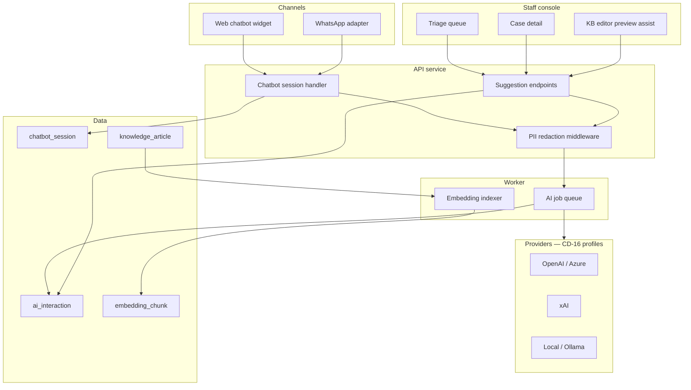
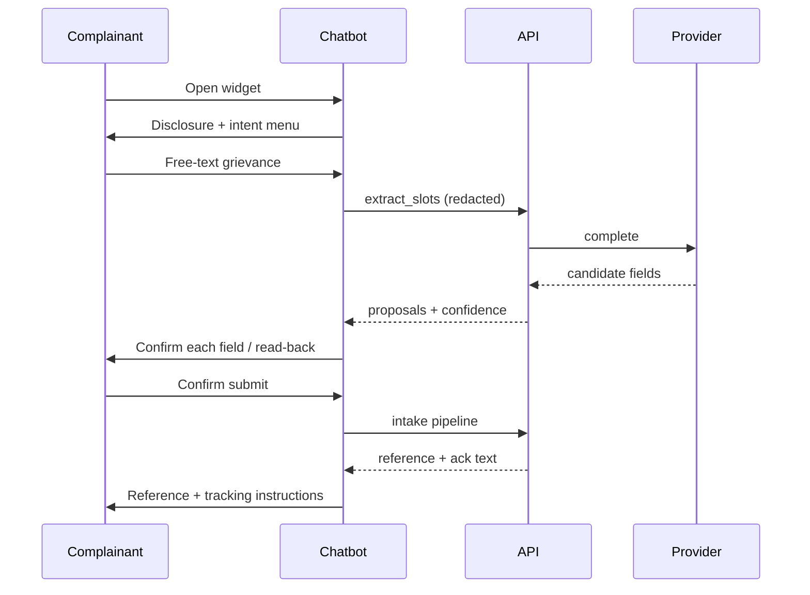
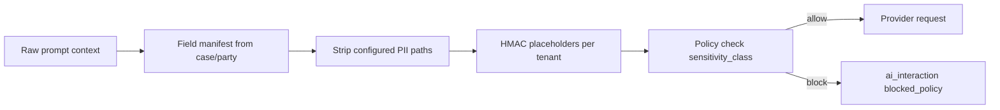

# 16 — Chatbot & AI Integration

Opt-in conversational intake and staff/triage AI assistance for the generic eGRM platform. Configuration domain **CD-16**; requirements **GEN-AI-01…06** (spec 10). Channel placement: spec 05 §1 (chatbot row); security context: spec 07.

**Status:** Not implemented — CD-16 admin entry exists (`cd16_ai`, permissive schema); CD-14 flags `chatbot_intake` / `ai_assistance` default off; `admin:ai_config` permission defined. Planned delivery: spec 12 Phase 6.

**Precedent:** KISIP production runs a separate `document_ai` service (chunked embeddings, OpenAI/xAI keys, RAG over uploaded documents). This spec generalizes that pattern behind tenant governance.

---

## 1. Problem statement

GRM programmes face predictable friction:

| Pain | How AI can help | What must not happen |
|---|---|---|
| Low-literacy or mobile-first complainants struggle with long forms | Chatbot slot-filling in local language | Bot files a case without human-readable confirmation |
| Staff triage backlog; inconsistent categorization | Suggested category, priority, duplicate links | Auto-assignment or auto-closure without officer review |
| GBV/SEA-SH content missed at intake | High-recall sensitivity signals | False negative treated as “cleared”; PII sent to public models unchecked |
| Handover / escalation loses context | Summaries and thread digests | AI summary replaces the authoritative record |
| FAQ load on hotline and walk-in desks | KB RAG on published articles | Hallucinated policy answers; sensitive KB leaked to chatbot |
| Multi-language submissions | Detection + staff-side translation | Machine-translated outbound messages without explicit tenant opt-in |

The platform therefore offers **two optional modules** — chatbot intake and staff AI aids — under **non-negotiable governance**: human-in-the-loop for every case decision, full audit, PII minimization, and restriction-first handling for sensitive content.

---

## 2. Scope & positioning

### 2.1 In scope

- **Chatbot intake channel** — web widget; WhatsApp/Telegram via gateway adapter (same engine).
- **Staff & triage capabilities** — categorization, sensitivity detection, semantic dedupe, summarization, translation, draft responses, KB answer assist.
- **CD-16 configuration** — provider profiles, per-capability flags, chatbot persona/intents, safety policy.
- **AI audit & quality** — `ai_interaction` records, accept/reject workflow, kill switches, dashboards.
- **Provider adapter layer** — OpenAI, Azure OpenAI, xAI, self-hosted (Ollama-compatible); keys in vault.
- **RAG corpora** — published knowledge-base articles; optional tenant document sets (KISIP `document_ai` pattern).

### 2.2 Out of scope (v1)

- Autonomous case handling (status change, assignment, closure, outbound messages without staff approval).
- AI-generated notifications sent directly to complainants (except chatbot’s scripted, tenant-approved disclosure and read-back text).
- Training or fine-tuning on tenant case data by default (provider profiles declare **no-training**; local models optional).
- Voice/IVR conversational AI (hotline remains operator-assisted; spec 05).
- Real-time streaming co-pilot in every text field (batch suggestion endpoints only in v1).

### 2.3 Module activation

Coarse switches in **CD-14** (spec 02):

| Flag | Effect |
|---|---|
| `chatbot_intake` | Exposes chatbot channel in CD-08; portal widget + gateway webhooks |
| `ai_assistance` | Enables staff/triage capabilities in console |

Both default **false**. Either can be on independently. **KUSP2** keeps both off (FR-PUB-15 prohibits chatbot). **KISIP** profile enables `ai_assistance` only (KB assist + summarization).

---

## 3. Architecture



| Layer | Responsibility |
|---|---|
| **Channel adapter** (`chatbot`) | Session state, intent routing, slot-filling over CD-06, read-back, handoff — implements spec 05 §6 contract |
| **Suggestion service** | Stateless “propose” endpoints; never mutates case rows |
| **PII redaction** | Strips/pseudonymizes party fields, national ID, phone, email, address before egress; logs redaction manifest hash |
| **Worker** | Async embedding refresh, long summarization, batch re-index; retries with backoff |
| **Provider adapter** | Uniform `complete`, `embed`, `moderate` interface; model + endpoint from CD-16 profile |

---

## 4. Platform governance (non-configurable)

These rules apply whenever **any** GEN-AI capability is enabled for a tenant. They are **not** CD-16 toggles.

| # | Rule | Enforcement |
|---|---|---|
| G1 | **Human-in-the-loop** | AI never calls workflow actions, assignment APIs, or `thread.reply_external` on its own. UI exposes Accept / Edit / Reject; only Accept (or edited accept) writes case fields. |
| G2 | **Restriction-first sensitivity** | Positive sensitivity signal immediately applies the class policy (visibility, redaction, routing) **pending** human confirmation; officers cannot dismiss without permission `sensitive:handle`. |
| G3 | **PII minimization** | Redaction middleware runs on every external provider call; block egress if policy violation. Local-model profile may skip external egress entirely. |
| G4 | **Full audit** | Every provider call → `ai_interaction` row (§6). Chatbot turns → `chatbot_session` + link to case on submit. |
| G5 | **Kill switches** | Per-capability disable in CD-16 + emergency tenant-wide `ai_assistance_enabled: false` audited like notification kills (spec 06). In-flight jobs complete but new calls return `503 ai_disabled`. |
| G6 | **No complainant-facing free text from staff-AI** | Draft responses require staff edit + explicit send. Machine translation to complainant requires CD-16 `allow_machine_translation_outbound: true`. |
| G7 | **Sensitive corpus exclusion** | Cases with `sensitivity_class` not in `allowed_processing_classes` are rejected at redaction layer unless profile + policy explicitly allow. |
| G8 | **Appeals evidence** | Accepted suggestions store `ai_interaction_id` on the resulting `case_event` or field-edit audit for reproducibility. |

---

## 5. Capabilities

### 5.1 Chatbot intake (GEN-AI-01, GEN-AI-02)

A **channel adapter** only — normalized output is `IntakeSubmission` (spec 05 §6).

| Aspect | Specification |
|---|---|
| **Surfaces** | Portal embed (`<egrm-chatbot>` or Nuxt plugin); WhatsApp Business / Telegram via gateway webhook sharing session backend |
| **Intents** | `file_case`, `check_status`, `kb_faq`, `handoff` — tenant enables subset in CD-16 |
| **Slot-filling** | Driven by CD-06 form + CD-08 chatbot `channel_minimum` fields (defaults align with USSD minimum: unit, summary, category) |
| **Free-form extraction** | Model may propose field values from narrative; UI/bot **must confirm each** before commit |
| **Read-back** | Summary card in complainant’s locale; explicit “Submit” / “Edit” |
| **Status check** | Same verifier rules as portal track (reference + phone/email/PIN); no extra data leakage |
| **KB FAQ** | RAG over `knowledge_article` where `status=published` and `sensitivity=none`; citations required; fallback “I don’t know — talk to a person” |
| **Handoff** | User phrase or button → `handoff` intent → creates `assisted_intake_callback` task or displays hotline; **mandatory** on sensitivity signal mid-session |
| **Disclosure** | First message includes tenant `automated_agent_disclosure` (presence enforced, like free-of-charge statement on portal) |
| **Anonymity** | If CD-08 allows anonymous web intake, bot offers anonymous path before PII slots |
| **Consent** | Conversational consent capture → `consent_record` before PII slots |
| **Transcript** | Full session stored; on successful intake, `chatbot_session.case_id` set; transcript attachment kind `chatbot_transcript` (spec 14) |
| **Incomplete** | Missing required slots → case created with `requires_completion=true` (same as USSD) |



### 5.2 Staff & triage AI (GEN-AI-03, GEN-AI-04, GEN-AI-05)

Each capability is independently enabled in CD-16. All return **suggestions** — see §7 API.

| Capability | Trigger | Input | Output | UI surface |
|---|---|---|---|---|
| `auto_categorize` | Intake complete / triage open | summary, description, custom fields (redacted) | `{category[], case_type, priority, confidence}` | Triage form pre-fill chips |
| `sensitivity_detect` | Intake + optional thread scan | full text (policy-gated) | `{class, confidence, indicators[]}` | Banner + immediate restriction (G2) |
| `semantic_dedupe` | After intake validate | embedding of summary+description | `{candidates:[{case_id, score}]}` | Merge/link modal (spec 05 §5) |
| `summarize_case` | Officer action | case id, scope: `full\|timeline\|thread` | `{markdown, token_count}` | Case header card; regenerable |
| `translate` | Officer action | text + target locale | `{translated, detected_locale}` | Side panel; original immutable |
| `draft_response` | Compose thread / status | case context + canned response ids | `{draft_text, citations[]}` | Thread composer “Suggest draft” |
| `kb_answer_assist` | Staff KB search / chatbot | query | `{answer, article_ids[], confidence}` | KB admin preview + chatbot FAQ |

**Semantic dedupe** augments rule-based dedupe (spec 05 §2): tenant configures combined behavior in CD-06 `dedupe_policy` — rule-only, AI-only, or both (AI suggestions above threshold).

---

## 6. Data model

### 6.1 `ai_interaction`

Append-only audit of every provider call and staff decision.

| Column | Type | Notes |
|---|---|---|
| `id` | uuid | PK |
| `tenant_id` | uuid | |
| `case_id` | uuid | nullable — KB assist may be case-less |
| `chatbot_session_id` | uuid | nullable |
| `capability` | text | enum: see §5.2 + `chatbot_extract`, `chatbot_reply`, `moderation` |
| `provider_profile_id` | text | CD-16 profile key |
| `model` | text | e.g. `gpt-4o-mini-2024-07-18` |
| `input_hash` | text | SHA-256 of redacted prompt |
| `input_token_count` | int | nullable |
| `output_token_count` | int | nullable |
| `suggestion` | jsonb | structured per capability |
| `confidence` | numeric | nullable 0–1 |
| `status` | text | `completed\|failed\|blocked_policy\|redacted_empty` |
| `error` | text | nullable |
| `decision` | text | nullable — `accepted\|edited\|rejected\|pending` |
| `decided_by` | uuid | nullable — `app_user.id` |
| `decided_at` | timestamptz | nullable |
| `applied_event_id` | uuid | nullable — `case_event.id` when acceptance mutates case |
| `latency_ms` | int | |
| `created_at` | timestamptz | |

Indexes: `(tenant_id, case_id, created_at)`, `(tenant_id, capability, created_at)`, `(tenant_id, decision, capability)`.

### 6.2 `chatbot_session`

| Column | Type | Notes |
|---|---|---|
| `id` | uuid | PK |
| `tenant_id` | uuid | |
| `channel` | text | `web_widget\|whatsapp\|telegram` |
| `external_thread_id` | text | nullable — gateway id |
| `locale` | text | |
| `intent` | text | current intent |
| `slots` | jsonb | confirmed vs proposed slots |
| `transcript` | jsonb | `[{role, text, at}]` |
| `case_id` | uuid | nullable — set on successful intake |
| `handoff_reason` | text | nullable |
| `handoff_task_id` | uuid | nullable |
| `sensitivity_flagged` | boolean | default false |
| `ended_at` | timestamptz | nullable |
| `created_at` | timestamptz | |

### 6.3 `embedding_chunk` (RAG)

| Column | Type | Notes |
|---|---|---|
| `id` | uuid | |
| `tenant_id` | uuid | |
| `source_kind` | text | `knowledge_article\|canned_response\|document_corpus` |
| `source_id` | uuid | |
| `chunk_index` | int | |
| `content_hash` | text | change detection |
| `embedding` | vector(1536) | pgvector; dimension per profile |
| `metadata` | jsonb | title, locale, published_at |
| `indexed_at` | timestamptz | |

Re-index on article publish/update via worker job. **Never** index draft or sensitive-restricted articles.

### 6.4 Case field linkage

When staff **accepts** a suggestion:

- Field edits go through normal field-edit audit (spec 03) with `meta.ai_interaction_id`.
- Sensitivity confirmation creates `case_event` kind `sensitivity_confirmed` or `sensitivity_cleared`.
- Semantic dedupe **link** uses existing merge/link APIs (spec 05 §5).

---

## 7. API surface

All staff endpoints require authentication + case permissions. Chatbot public endpoints are rate-limited and tenant-scoped.

### 7.1 Staff suggestion endpoints

```
POST /api/v1/cases/{id}/ai/suggest
  body: { capability, params? }
  → { interaction_id, suggestion, confidence }

POST /api/v1/ai/interactions/{id}/decide
  body: { decision: accepted|edited|rejected, edited_payload?, apply? }
  → { interaction, case? }

GET  /api/v1/cases/{id}/ai/interactions
  → { interactions[] }   // history for appeals
```

Capabilities in `suggest` body match CD-16 enabled flags; disabled → `403 ai_capability_disabled`.

### 7.2 Chatbot (public)

```
POST /api/v1/public/chatbot/sessions
  → { session_id, disclosure_text, intents[] }

POST /api/v1/public/chatbot/sessions/{id}/messages
  body: { text, locale? }
  → { replies[], slots?, handoff?, done? }

POST /api/v1/public/chatbot/sessions/{id}/confirm
  body: { slots, submit: boolean }
  → { case_id?, reference?, requires_completion? }
```

### 7.3 Admin / config

```
GET  /api/v1/admin/config/cd16_ai          // active + draft (spec 09 pattern)
POST /api/v1/admin/config/cd16_ai/validate
POST /api/v1/admin/ai/test-profile         // send canary prompt; no case data
GET  /api/v1/admin/ai/quality-summary      // acceptance rates, §8
```

### 7.4 Internal worker jobs

| Job | Payload |
|---|---|
| `ai.suggest` | deferred heavy summarization |
| `ai.index_article` | `{ article_id }` |
| `ai.index_corpus` | full rebuild (admin action) |

---

## 8. Quality & monitoring

Dashboard widgets (CD-15 / spec 08) for tenants with AI enabled:

| Metric | Use |
|---|---|
| Suggestion acceptance rate | per capability, 7/30 day |
| Override / edit rate | model drift signal |
| Sensitivity false-positive rate | officers clearing flags within 24h |
| Sensitivity false-negative proxy | retroactive manual upgrades to `gbv_seah` |
| Chatbot completion rate | sessions → submitted cases |
| Chatbot handoff rate | accessibility pressure |
| Provider error rate / latency | ops |
| Token usage | cost allocation per tenant |

Alerts: provider error spike, `blocked_policy` count spike, kill switch activated.

---

## 9. CD-16 configuration schema

Validated via `packages/config-schemas` (strict zod). Summary:

```yaml
# CD-16 — illustrative active config
enabled: true   # master switch; CD-14 flags must also be on

provider_profiles:
  kisip_openai:
    kind: openai                    # openai | azure_openai | xai | ollama
    endpoint: https://api.openai.com/v1
    api_key_ref: vault:openai/kisip # never stored in config body
    default_model: gpt-4o-mini
    embedding_model: text-embedding-3-small
    data_residency: us              # declared jurisdiction
    no_training: true               # contractual flag
    max_tokens_per_request: 4096

  local_llm:
    kind: ollama
    endpoint: http://ollama.internal:11434
    default_model: llama3.1:8b
    data_residency: on_prem
    no_training: true

capabilities:
  auto_categorize:       { enabled: false, profile: kisip_openai, min_confidence: 0.6 }
  sensitivity_detect:    { enabled: true,  profile: kisip_openai, min_confidence: 0.5, allowed_processing_classes: [normal, corruption] }
  semantic_dedupe:       { enabled: false, profile: kisip_openai, similarity_threshold: 0.85, lookback_days: 90 }
  summarize_case:        { enabled: true,  profile: kisip_openai }
  translate:             { enabled: false, profile: kisip_openai }
  draft_response:        { enabled: false, profile: kisip_openai }
  kb_answer_assist:      { enabled: true,  profile: kisip_openai, max_citations: 3 }

chatbot:
  enabled: false                    # requires CD-14 chatbot_intake
  profile: kisip_openai
  locales: [en, sw]
  automated_agent_disclosure:
    en: "You are chatting with an automated assistant. A human officer will review your grievance."
    sw: "Unazungumza na msaidizi wa kiotomatiki. Afisa wa binadamu atapitia malalamiko yako."
  allowed_intents: [file_case, check_status, kb_faq, handoff]
  channel_minimum:                  # overrides; default = CD-08 ussd minimum
    fields: [unit_id, summary, categories]
  handoff:
    mode: callback_task             # callback_task | hotline_display
    hotline_contact_ref: hotline_primary
  persona:
    tone: respectful
    name: "KISIP Assistant"

safety:
  pii_redaction:
    strip_fields: [name, phone, email, national_id, address, representative_*]
    pseudonymize_party: true
  sensitive_processing:
    default: block                  # block | allow_with_profile
    allowed_classes: []             # e.g. [gbv_seah] only with local_llm profile
  allow_machine_translation_outbound: false
  moderation:
    enabled: true
    block_on_violence: true

rag:
  sources: [knowledge_article]      # knowledge_article | document_corpus
  reindex_on_publish: true
```

**Permission:** `admin:ai_config` required to edit CD-16. Config changes audited in `config_version` + `audit_event`.

---

## 10. PII redaction pipeline



| Data in prompt | Treatment |
|---|---|
| Party name, phone, email, ID, address | Removed; replaced with `[PARTY_PHONE_1]` tokens if structure needed |
| Case reference | Allowed |
| Status, category, level | Allowed |
| Thread / description body | Kept unless sensitivity block; optional sentence-level redaction for `gbv_seah` |
| KB articles | Published only; no PII examples in seed content |
| Staff user identity | Never sent to provider |

Redaction manifest hash stored on `ai_interaction.input_hash` so appeals can prove what left the boundary.

---

## 11. Security & permissions

| Permission | Use |
|---|---|
| `admin:ai_config` | Edit CD-16, test profiles, view quality dashboard |
| `case:read` + sensitivity clearance | Receive suggestions on a case |
| `case:edit_fields` | Accept categorization suggestions |
| `sensitive:handle` | Confirm or clear sensitivity flags |
| `thread:reply_external` | Send draft responses (after human edit) |

Chatbot public routes: CAPTCHA on session create (shared with portal anti-abuse); per-IP rate limits; no authenticated staff data in responses.

**Deployment:** Gov-hosted tenants may set all capabilities to `local_llm` profile only; SaaS tenants default to declared-residency cloud profiles.

---

## 12. UI specification (console & portal)

### 12.1 Admin — Configuration → Chatbot & AI (`cd16_ai`)

- Provider profile CRUD (keys via vault refs, not plain text).
- Capability toggles + model picker per capability.
- Chatbot persona, disclosure text per locale (presence validation).
- Safety policy editor with warnings when enabling external provider for sensitivity.
- **Test profile** button (canary prompt).
- Quality dashboard embed (§8).

### 12.2 Staff console

| Location | AI affordance |
|---|---|
| Triage / new case sidebar | Categorization + dedupe suggestions |
| Case header | “Summarize” expandable card (AI badge) |
| Sensitivity banner | AI-detected flag with confirm/clear actions |
| Thread composer | “Suggest draft” → editable textarea |
| Merge duplicates modal | Semantic matches tab |
| Field edit audit | “Suggested by AI” link → interaction detail |

All suggestions show **confidence** and **Accept / Edit / Dismiss**.

### 12.3 Portal

- Floating chatbot widget when `chatbot_intake` on (CD-01 theme colors).
- WCAG: keyboard navigable; screen-reader labels; no auto-play audio.

---

## 13. Tenant profile examples (spec 11)

**KISIP** — assistance without chatbot:

```yaml
cd14_features: { chatbot_intake: false, ai_assistance: true }
cd16_ai:
  capabilities:
    kb_answer_assist: { enabled: true }
    summarize_case: { enabled: true }
  chatbot: { enabled: false }
```

**KUSP2** — fully off:

```yaml
cd14_features: { chatbot_intake: false, ai_assistance: false }
# FR-PUB-15: no chatbot intake
```

**Hypothetical donor project** — chatbot for low-literacy areas:

```yaml
cd14_features: { chatbot_intake: true, ai_assistance: true }
cd16_ai:
  chatbot: { enabled: true, locales: [en, sn, nd] }
  capabilities:
    sensitivity_detect: { enabled: true }
    auto_categorize: { enabled: true }
```

---

## 14. Implementation plan

Aligned with spec 12 Phase 6. **Build governance first.**

| Step | Deliverable | Requirements |
|---|---|---|
| 1 | `ai_interaction` + redaction middleware + provider adapter package | GEN-AI-06 |
| 2 | CD-16 strict schema + admin editor + test-profile endpoint | GEN-AI-06 |
| 3 | `summarize_case`, `kb_answer_assist`, embedding indexer | GEN-AI-05 |
| 4 | `auto_categorize`, `semantic_dedupe` | GEN-AI-03 |
| 5 | `sensitivity_detect` with restriction-first UX | GEN-AI-04 |
| 6 | `draft_response`, `translate` | GEN-AI-05 |
| 7 | Chatbot session API + widget + handoff | GEN-AI-01, GEN-AI-02 |
| 8 | Quality dashboard + kill switches | GEN-AI-06 |

**Exit criteria:** Pilot tenant runs with ≥1 capability enabled; 100% of applied suggestions have `decided_by`; zero autonomous case transitions; penetration test on chatbot rate limits and PII egress.

---

## 15. Requirements traceability

| ID | Priority | This spec |
|---|---|---|
| GEN-AI-01 | Could | §5.1, §7.2, §12.3 |
| GEN-AI-02 | Could | §5.1 handoff, G2 |
| GEN-AI-03 | Could | §5.2 auto_categorize, semantic_dedupe |
| GEN-AI-04 | Could | §5.2 sensitivity_detect, G2 |
| GEN-AI-05 | Could | §5.2 summarize, translate, draft, kb_answer_assist |
| GEN-AI-06 | Must* | §4, §6, §9, §10, §8, §11 |

---

## 16. Open decisions

| # | Question | Default recommendation |
|---|---|---|
| D1 | pgvector in main DB vs separate `document_ai` DB? | pgvector in tenant DB for KB; optional corpus DB for large doc sets (KISIP parity) |
| D2 | Streaming responses in chatbot UI? | v2; v1 full-message round trips |
| D3 | WhatsApp in v1 or v2? | v1 web widget only; WhatsApp behind feature flag v1.1 |
| D4 | Officer-initiated batch AI on queues? | v2; v1 case-scoped only |
| D5 | Cost caps per tenant? | CD-16 `monthly_token_budget` soft limit with admin alert |

---

## 17. Related documents

| Doc | Relationship |
|---|---|
| [05-intake-and-channels.md](05-intake-and-channels.md) | Chatbot as channel; intake pipeline; dedupe |
| [02-configuration-model.md](02-configuration-model.md) | CD-16, CD-14 flags |
| [03-domain-model.md](03-domain-model.md) | Case, party, audit |
| [07-security-access-control.md](07-security-access-control.md) | Sensitivity classes, PII encryption |
| [08-reporting-kpis.md](08-reporting-kpis.md) | AI quality widgets |
| [09-api-integrations.md](09-api-integrations.md) | Admin config API patterns |
| [10-requirements-catalogue.md](10-requirements-catalogue.md) | GEN-AI-* |
| [11-tenant-profiles.md](11-tenant-profiles.md) | KISIP / KUSP2 AI settings |
| [12-development-plan.md](12-development-plan.md) | Phase 6 schedule |
| [14-case-attachments-and-documents.md](14-case-attachments-and-documents.md) | `chatbot_transcript` kind |
| [15-complainant-correspondence.md](15-complainant-correspondence.md) | Draft responses → thread |
